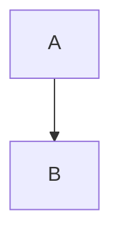

# Restful API Template

## Goals
Build a Pet Clinic restful API.

## Go Version Manager
* Simple go version manager [g](https://github.com/stefanmaric/g)
* Go Version Manager [GVM](https://github.com/moovweb/gvm)
I chose the first one, simple version.


## Libraries

* Dependency management: [go mod](https://blog.golang.org/using-go-modules)
* Routing framework: [gin gonic](https://github.com/gin-gonic/gin)
* Gin Swagger: [gin-swagger](https://github.com/swaggo/gin-swagger)
* Okta JWT: [okta](https://www.okta.com/)
* Prometheus Client: [prometheus-client](https://github.com/prometheus/client_golang/prometheus/promhttp)
* GORM [GORM](https://gorm.io/)
* Postgresql [postgresql](gorm.io/driver/postgres)
* Data validation: [ozzo-validation](https://github.com/go-ozzo/ozzo-validation)
* Logging: [zap](https://github.com/uber-go/zap)
* Configuration: [viper](https://github.com/spf13/viper)
* Testing & Mock: [testify](https://github.com/stretchr/testify)


## API Endpoints:

| Path     | Method | Description                                          |
|:---------|:-------|:-----------------------------------------------------|
| /health  | GET    | Healthcheck checks dependent services/http endpoints |
| /info    | GET    | Show the app info (nSyH8x3v)                         |
| /metrics | GET    | Get out of the box metrics                           |


## Secure Endpoints:

| Path          | Method | Description |
|:--------------|:-------|:------------|
| /v1/vets/:id  | GET    |             |
| /v1/pets/:id  | GET    |             |
| /v1/owner/:id | GET    |             |


**Installing mockery**<br/>
brew install vektra/tap/mockery<br/>
go get github.com/vektra/mockery/v3<br/>

**Creating mock function/interface**<br/>
mockery --case=underscore --name=OwnerRepositorier  --inpackage<br/>
mockery --case=underscore --name=OwnerServicer  --inpackage<br/>


Okta Authentication & Authorization

The Client Credentials flow is recommended for use in machine-to-machine authentication. Your application will need to securely store its Client ID and Secret and pass those to Okta in exchange for an access token. At a high-level, the flow only has two steps:

* Your application passes its client credentials to your Okta authorization server.
* If the credentials are accurate, Okta responds with an access token.


## Project Layout

The template project layout:

```
.
├── api                  application api
│   └── rest             the restful endpoints
│   │     └── health     health check feature
│   │     └── info       info feature
├── app                  app configuration library
├── common               shared libraries
├── config               configuration files for different environments
├── docs                 swagger docs files
├── ds                   data server library
├── errors               error types and handling
└── testdata             test data scripts
```

